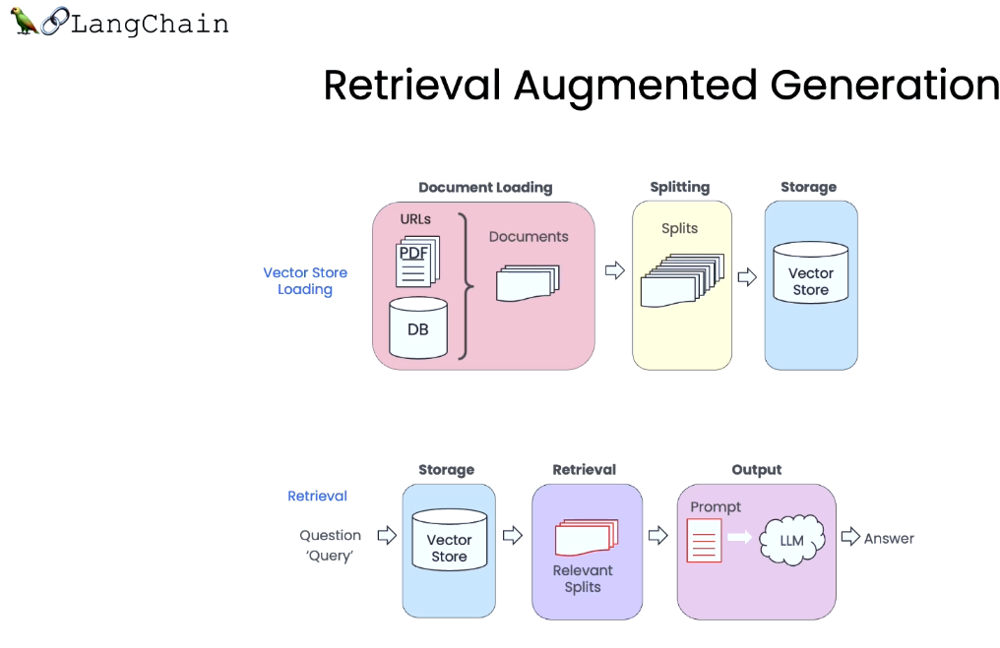

# LangChain Chat with Your Data

태그: In progress
생성 일시: 2023년 10월 24일 오후 6:32

## LangChain & faiss study

- LangChain Chat with Your Data:  [강의 링크](https://learn.deeplearning.ai/langchain-chat-with-your-data/lesson/1/introduction)
    - Retrieval-augmented LLM 파이프라인 구현과 관련된 langchain 활용 강의
- retrieval index로 자주 쓰이는 faiss 랑 어떤 차이가 있는지 공부

---

## LangChain Chat with Your Data

### 0. Introduction

- 나의 데이터 document와 LLM을 가지고 customer와 Question&Answering을 할 수 있게.

### 1. Document Loading

- unstructured / structured dataset을 모두 loading 할 수 있도록 한다.
- 다양한 나의 소스 데이터를 올린 다음에 적절하게 split해서 db에 저장하는 방식. 자동으로 처리해주기 때문에 굉장히 유용할 것으로 보인다.
- faiss 와 다른 점은 faiss는 이미 내가 임베딩 벡터를 만들고 index로 storage하는 상태로 있는다고 한다면, lnagchain은 더 다이나믹하게 접근할 수 있게 한다는 점이 다르다고 볼 수 있다.

### 2. Document Splitting

### 3. Vectorstores and Embeddings

- 우리는 정관을 rule-base로 split했고, langchain은 자동으로 split했다는 점에서 차이가 있다.
- 그 다음에는 똑같이 openAIEmbedding으로 임베딩을 만들어서 벡터를 저장하고, index에서 서치하는 방식은 똑같이 사용하고 있다.
- 여기서는 Chroma라는 벡터 storage를 사용한다는 것만 차이가 있다.
    - [https://zephyrnet.com/ko/생성-AI를-위한-벡터-저장소인-Chroma-db-가이드/](https://zephyrnet.com/ko/%EC%83%9D%EC%84%B1-AI%EB%A5%BC-%EC%9C%84%ED%95%9C-%EB%B2%A1%ED%84%B0-%EC%A0%80%EC%9E%A5%EC%86%8C%EC%9D%B8-Chroma-db-%EA%B0%80%EC%9D%B4%EB%93%9C/)
    - 특별한 것이라기 보다는, 비슷한 벡터 storage 라이브러리 중 크로마를 선택하고 있는 것
- 임베딩 서치 method에 대한 failure 들을 보여주고 있음 → 임베딩이 유사할 경우 거의 동일한 정보만 계속 가져올 수 있다는 것과, 3번째 강의에서 언급한 내용만 가져오라고 해도, content를 기반으로 찾아오기 때문에 다른 것들도 찾아올 수 있다는 한계점에 대하여 언급한다.

### 4. retrieval

- 앞의 렉쳐에서 다뤘던 edge cases에 대한 문제를 해결하기 위한 retrieval 기법을 소개한다.

- query와 가장 관련있는 거 뿐만 아니라 diverse도 보장할 수 있게끔 가져온다.

- LLM을 이용해서 original question을 re-writing 하는 것 (query generation과 동일)
- 특히, 메타 데이터의 정보도 필요한 경우에 유용. 즉 filter로 contentent들을 한 번 걸러주고, 그 다음에 search term을 찾게끔 만드는 것

### 5. Question Answering

- relevant document 가 너무 많은 경우에는 다 넣을 수가 없기 때문에 위와 같은 3가지 방법을 활용한다.
- langchain plus platform을 이용하면 이런 기능들을 사용할 수 있고, 어떻게 돌아갔는지 child runs도 확인할 수 있다.
    
    
    
- 이거이거 langchain 들어갔는데 waitlist 넣어놔야 하네,,, 아직 closed beta이다.

### 6. chat

- 지금까지 구현했던 `RetrievalQA` 를 사용한 qa_chain 에다가, dialogue history를 기억할 수 있는 `ConversationBufferMemory` 를 활용한 memory를 이용해서, `ConversationalRetrievalChain` 을 구현하기.
- memory 덕분에 Chain input에 chat_history가 자동으로 들어간다.

**(++) 한국어에서 이게 잘 적용이 되려나? 안 될 수 있을 거 같음. 확인하는 것이 필요함.** 

---

## Faiss

- Faiss 는 Facebook AI에서 개발한 유사도 검색 모델
- dense vector의 효율적인 유사도 검색 및 클러스터링을 위한 라이브러리
- Faiss는 numpy나 torch에서 제공해주는 cosine_similarity보다 훨씬 빠르다.
- (++) faiss에서 query벡터들을 병렬처리해서 가져올 수 있도록 코드를 짜면 더 좋을듯,,,??
- 가장 기본적인 Flat으로 유사도를 구하는 방법론과 더불어, 인덱싱된 벡터들로 구축된 그래프를 기반으로 하여 가장 가까운 이웃으로 수렴하는 방식으로 참석할 수도 있다. hierarchical하게 검색하는 구조도 지원한다.
- faiss는 DB를 실시간으로 바꿔끼우는 것이 아니라, 미리 구축되어 있는 벡터로 index를 만들고 거기서 서치할 수 있게 한다.
- 즉, document를 load, split, vector, embedding 하는 과정에는 faiss가 관여하지 않고, retrieval을 빠르게 하는 방식으로 이루어져 있다.

[16. FAISS에 대한 모든 것 - NLP AI](https://dajeblog.co.kr/16-faiss에-대한-모든-것/)

[[챗봇] faiss로 빠르게 유사도 검색하기(Similarity Search)](https://acdongpgm.tistory.com/286)

[FAISS 설명 및 사용법](https://beausty23.tistory.com/203)

[https://east-rain.github.io/docs/Deep Learning/vector search/](https://east-rain.github.io/docs/Deep%20Learning/vector%20search/)